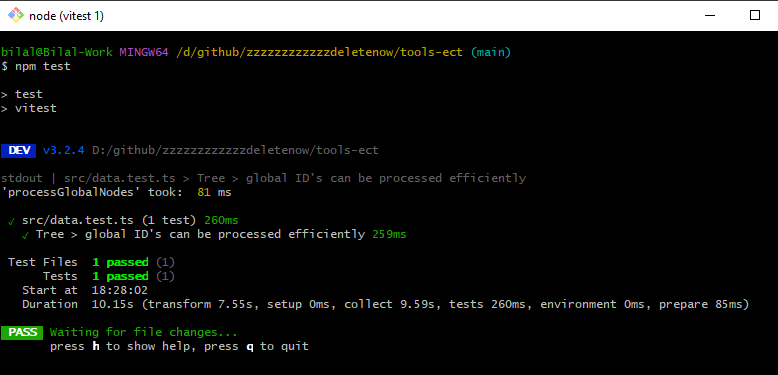

# 🧪 Don't traverse a tree over and over even if you have the urge!

A develoepr wannabe scratching around with the help of AI

## 🛠️ Tech Stack

- **Testing Framework**: [Vitest](https://vitest.dev/)
- **Language**: [TypeScript](https://www.typescriptlang.org/)

## 📦 How to run?

```bash
# Clone the repository
git clone https://github.com/taherkheli/tools-ect
cd tools-ect

# Install dependencies
$ npm i

# Run the test
$ npm test
```

## Screenshots

### Local Test Run (Successful)


